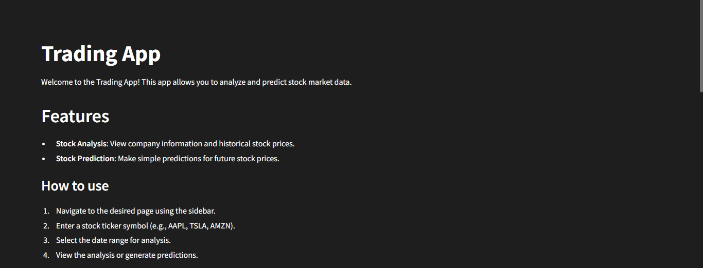
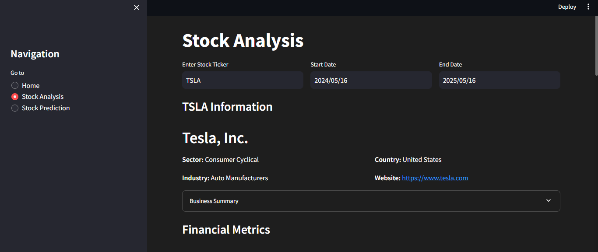
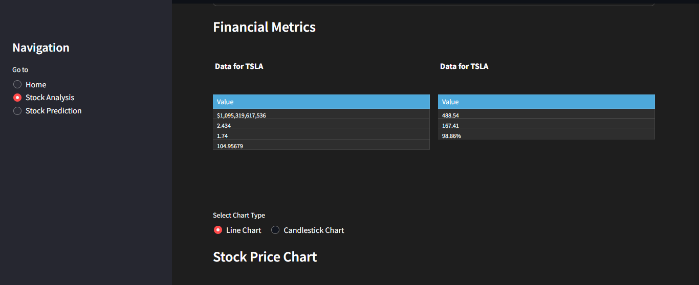
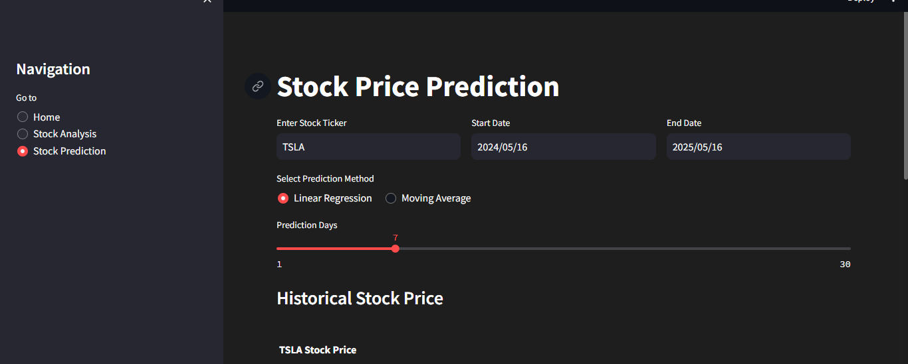

# 📈 Stock Trading App

A simple and interactive web application for stock analysis and price prediction using **Streamlit**, **yfinance**, and **Plotly**.

---

## 📋 Table of Contents

- [Overview](#overview)
- [Features](#features)
- [Installation](#installation)
- [Usage](#usage)
- [Project Structure](#project-structure)
- [Dependencies](#dependencies)
- [Troubleshooting](#troubleshooting)

---

## 🧠 Overview

This application enables users to analyze historical stock data and predict future stock prices using **Linear Regression** and **Moving Average** techniques.

---

## 🚀 Features

- 📊 **Stock Analysis**: View company info, historical prices, and key metrics  
- 📈 **Price Visualization**: Line and candlestick charts  
- 🔄 **Trading Volume Analysis**  
- 🤖 **Stock Prediction**:
  - Linear Regression
  - Moving Average  
- 🧑‍💻 **User-Friendly Interface** with sidebar navigation

---
---

## 🖼️ Screenshots

### 📌 Stock Analysis Page


### 📌 Candlestick Chart View


### 📌 Trading Volume Insights


### 📌 Price Prediction using Linear Regression



## 🛠️ Installation

Make sure **Python 3.7+** is installed.

1. Clone the repository:

   ```bash
   git clone https://github.com/Ydharm/stock-trading-app.git
   cd stock-trading-app
